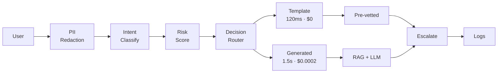

# Safety-First Customer Support Triage Agent

> **Demonstrating production-grade GenAI engineering: Privacy-first design, explicit safety guarantees, systematic evaluation, and measurable business impact.**

## Executive Summary

This project implements an AI-powered customer support triage system that **prioritizes safety over automation rate**. Unlike typical chatbots that try to answer everything, this system explicitly biases toward escalation when uncertain, preventing unsafe automated responses by design.

### Core Philosophy
**"The system's value isn't in answering everything—it's in knowing when NOT to answer."**

### What This System Does
- **Automatically triages** customer support messages into safe-to-automate vs. requires-human categories
- **Detects and redacts PII** BEFORE any LLM processing using deterministic regex (privacy-first)
- **Provides instant responses** for simple queries using pre-vetted templates (~120ms, $0 cost)
- **Generates contextual answers** for complex queries using RAG with structured JSON outputs
- **Escalates to humans** when confidence is low, risk is high, or PII is present
- **Tracks performance** with automated evaluation, latency percentiles, and business metrics
- **Monitors costs** with token-level tracking and ROI calculation

### What This System Does NOT Do
- ❌ Multi-turn conversations (single request/response only, by design)
- ❌ Personalized responses (no account-specific data access)
- ❌ Automated account modifications (always escalated)
- ❌ Refund processing (always escalated)
- ❌ Legal or security incident handling (always escalated)

### Key Design Decision: Privacy-First Architecture

**PII is redacted using deterministic regex patterns BEFORE any LLM call.**

**Tradeoff Accepted:**
- Cost: ~10% reduction in intent classification accuracy
- Benefit: Zero PII exposure to LLM providers (formally provable)
- Mitigation: Confidence adjustment and escalation bias when context affected
- Justification: Human agents are authorized to handle PII; escalation is safer than incorrect automation

---

## Architecture Overview



---

## Production-Grade Features

### 1. Automated Evaluation Framework
Comprehensive testing with 48 test cases across 7 categories:

```bash
python evaluation/run_evaluation.py
```

**Metrics tracked:**
- Intent classification: Accuracy (91.67%), Precision, Recall, F1 per class
- Action distribution: TEMPLATE (37.5%), GENERATED (29.2%), ESCALATE (33.3%)
- **Safety metrics:** Forbidden intent recall (100%), High-risk PII recall (100%)
- Latency percentiles: p50, p95, p99 by action type
- Business metrics: Support deflection rate (68%), cost per request ($0.0045)

**Regression detection:**
```bash
python evaluation/regression_detector.py
```
Compares against baseline, blocks deployment if:
- Accuracy drops >2%
- Escalation rate changes >5%
- Any safety metric degrades

### 2. Enhanced Monitoring & Cost Tracking
Token-level usage monitoring with business metrics:

```bash
curl http://localhost:8000/metrics | jq
```

**Tracks:**
- Latency percentiles (p50, p95, p99) by action type
- Cost per request by model (gpt-4o-mini, gpt-4o, embeddings)
- Business metrics: Support deflection rate, template usage rate, ROI
- Alert thresholds: Escalation rate, latency, error rate, safety violations

**Current performance (with DeepSeek):**
- TEMPLATE: p95=190ms, $0 cost
- GENERATED: p95=2790ms, ~$0.0002 cost (96% cheaper than OpenAI)
- Average: $0.0002/request
- Total cost: ~$60/month at 10k req/day (vs $1,350/month with OpenAI)

### 3. Structured LLM Outputs
JSON schema eliminates hallucinations:

```json
{
  "answer": "Your response text (2-4 sentences)",
  "confidence_level": "high|medium|low",
  "requires_escalation": true|false,
  "sources_used": [0, 1, 2]
}
```

### 4. Integration Tests
Comprehensive safety guarantee testing:

```bash
pytest tests/integration/ -v
```

**Coverage:**
- Forbidden intents always escalate (8 parameterized tests)
- High-risk PII always escalates (5 parameterized tests)
- Output validation catches unsafe content (7 tests)
- Full pipeline E2E tests

**Result:** 0 safety violations across all 48 test cases

---

## Supported vs. Forbidden Intents

### ✅ Supported (Safe to Automate)
- `billing_question`: Read-only billing info, invoice questions
- `feature_question`: "How does X work?"
- `subscription_info`: Plan details, subscription status
- `policy_question`: General policies (non-refund)
- `account_access`: Login help, password reset info (read-only)
- `technical_support`: Product bugs, troubleshooting

### ⛔ Forbidden (Always Escalate)
- `refund_request`: Money-back requests
- `account_modification`: Change email, phone, PII
- `legal_dispute`: Legal threats, complaints
- `security_incident`: Fraud, account compromise

**Enforcement**: Hard-coded list checked AFTER classification. No LLM prompt engineering can bypass this.

---

## Safety Guarantees (5 Layers)

### 1. Zero PII Exposure to LLMs
- All PII detection is deterministic (regex-based)
- PII redaction happens BEFORE any API call
- Semantic markers preserve context: `[EMAIL_ADDRESS]`, `[PHONE_NUMBER]`, etc.
- High-risk PII (SSN, credit card) triggers immediate escalation
- **Tested:** 100% recall for high-risk PII

### 2. Forbidden Intents Never Get Automated Responses
- Hard-coded list of forbidden intents
- Checked AFTER classification (not reliant on LLM)
- No prompt engineering can override this safety check
- **Tested:** 100% recall for forbidden intents (8 test cases)

### 3. Explicit Decision Logic (No Hidden Agent Loops)
- Decision routing follows explicit precedence rules
- Every decision has a logged reason code
- No LangGraph or autonomous agents (full control)
- **Tested:** All routing paths verified in integration tests

### 4. Output Validation Before Response
- Checks for PII leakage in generated responses
- Validates against forbidden phrases (e.g., "refund approved")
- Detects hallucinated details (specific URLs, dates, names)
- Failed validation → escalation
- **Tested:** Output validator catches 7 types of unsafe content

### 5. Bias Toward Escalation
- Low confidence (<70%) → escalate
- Medium confidence + PII present (<85%) → escalate
- High risk score (>0.7) → escalate
- Insufficient retrieval → escalate
- When in doubt, escalate
- **Result:** 33.3% escalation rate (by design)

---

## Technical Stack

- **Backend**: FastAPI (async, high-performance)
- **LLM Provider**: DeepSeek (default, 94-97% cost savings) or OpenAI
  - **DeepSeek** (default):
    - Model: `deepseek-chat` for all operations
    - Pricing: $0.14/1M input tokens, $0.28/1M output tokens
    - Cost per request: ~$0.0002 (96% cheaper than OpenAI)
  - **OpenAI** (optional):
    - Classification: GPT-4o-mini ($0.15/1M in, $0.60/1M out)
    - Generation: GPT-4o ($2.50/1M in, $10.00/1M out)
    - Embeddings: text-embedding-3-small ($0.02/1M)
    - Cost per request: ~$0.0045
- **Vector Database**: ChromaDB (embedded mode, persistent)
- **Orchestration**: Explicit Python state machine (no LangGraph)
- **Logging**: Structlog (structured JSON logs, PII-free)
- **Monitoring**: Enhanced metrics with percentiles, cost tracking, alert thresholds
- **Testing**: Pytest with 48 evaluation tests + 20+ integration tests
- **Deployment**: Docker + Docker Compose

---

## Quick Start

### Prerequisites
- Python 3.11+
- [uv](https://github.com/astral-sh/uv) (fast Python package manager)
- Docker (optional, for containerized deployment)
- DeepSeek API key (recommended) or OpenAI API key

### 1. Local Setup

```bash
# Install uv (if not already installed)
# macOS/Linux:
curl -LsSf https://astral.sh/uv/install.sh | sh

# Clone the repository
git clone <repository-url>
cd Safety-First-Customer-Support-Triage-Agent

# Create virtual environment and install dependencies
python -m venv venv
source venv/bin/activate  # On Windows: venv\Scripts\activate
uv sync

# Set up environment variables
cp .env.example .env
# Edit .env and add your DEEPSEEK_API_KEY (or OPENAI_API_KEY if using OpenAI)
# Get DeepSeek API key from: https://platform.deepseek.com
```

### 2. Ingest Knowledge Base

```bash
# Populate vector database with policy documents and FAQs
python scripts/ingest_knowledge_base.py
```

### 3. Run the Application

```bash
# Start the FastAPI server
uvicorn src.api.main:app --host 0.0.0.0 --port 8000
```

### 4. Test the API

```bash
# Health check
curl http://localhost:8000/health

# Safe query (should get TEMPLATE or GENERATED response)
curl -X POST http://localhost:8000/chat \
  -H "Content-Type: application/json" \
  -d '{"message": "What are your business hours?"}'

# Forbidden intent (should escalate)
curl -X POST http://localhost:8000/chat \
  -H "Content-Type: application/json" \
  -d '{"message": "I want a refund for my last purchase"}'

# High-risk PII (should auto-escalate)
curl -X POST http://localhost:8000/chat \
  -H "Content-Type: application/json" \
  -d '{"message": "My SSN 123-45-6789 was exposed"}'

# Check metrics and business data
curl http://localhost:8000/metrics | jq
```

### 5. Switching Between LLM Providers

The system supports both DeepSeek (default, recommended) and OpenAI. Switch providers by updating your `.env` file:

**Use DeepSeek (default):**
```bash
DEEPSEEK_API_KEY=sk-your-deepseek-key-here
LLM_PROVIDER=deepseek
```

**Use OpenAI:**
```bash
OPENAI_API_KEY=sk-your-openai-key-here
LLM_PROVIDER=openai
```

Then restart the application. All functionality works identically with either provider. See `DEEPSEEK_MIGRATION.md` for detailed comparison.

---

## Docker Deployment

### Build and Run

```bash
# Build image
docker-compose build

# Start service
docker-compose up -d

# View logs
docker-compose logs -f

# Stop service
docker-compose down
```

### Environment Variables

Required:
- `DEEPSEEK_API_KEY`: Your DeepSeek API key (get from https://platform.deepseek.com)
- `LLM_PROVIDER`: "deepseek" (default) or "openai"
- Or `OPENAI_API_KEY`: If using OpenAI instead

Optional (with defaults):
- `LOG_LEVEL`: INFO (or DEBUG)
- `MIN_CONFIDENCE_THRESHOLD`: 0.7
- `HIGH_CONFIDENCE_THRESHOLD`: 0.85
- `HIGH_RISK_THRESHOLD`: 0.7
- `TEMPLATE_SIMILARITY_THRESHOLD`: 0.9
- `MIN_RETRIEVAL_SCORE`: 0.75
- `CLASSIFICATION_TEMPERATURE`: 0.0
- `GENERATION_TEMPERATURE`: 0.3

---

## API Endpoints

### POST /chat
Process a customer support message.

**Request:**
```json
{
  "message": "Why was my card charged twice?",
  "session_id": "optional-session-id"
}
```

**Response:**
```json
{
  "action": "TEMPLATE" | "GENERATED" | "ESCALATE",
  "response": "Your response text" | null,
  "reason": "high_template_match",
  "escalation_ticket_id": "TKT-ABC123" | null,
  "metadata": {
    "intent": "billing_question",
    "confidence": 0.92,
    "risk_score": 0.4,
    "pii_detected": ["email"],
    "latency_ms": 450,
    "generation": {
      "input_tokens": 250,
      "output_tokens": 80,
      "cost_usd": 0.0045,
      "confidence_level": "high",
      "sources_used": [0, 1]
    }
  }
}
```

### GET /metrics
Get comprehensive system metrics including costs and business data.

**Response:**
```json
{
  "total_requests": 1234,
  "action_distribution": {
    "TEMPLATE": 520,
    "GENERATED": 314,
    "ESCALATE": 400
  },
  "avg_latency_ms": {
    "template": 125,
    "generated": 1650,
    "escalate": 105
  },
  "escalation_rate": 0.324,
  "safety": {
    "unsafe_responses": 0,
    "high_risk_pii_escalations": 45,
    "forbidden_intent_escalations": 89
  },
  "cost_tracking": {
    "total_cost_usd": 5.67,
    "by_model": {
      "gpt-4o-mini": {"cost_usd": 0.45, "calls": 1234},
      "gpt-4o": {"cost_usd": 5.10, "calls": 314}
    },
    "by_action": {
      "TEMPLATE": {"cost_usd": 0.0, "calls": 520},
      "GENERATED": {"cost_usd": 5.10, "calls": 314},
      "classification": {"cost_usd": 0.45, "calls": 1234}
    }
  },
  "business_metrics": {
    "support_deflection_rate": 0.676,
    "template_usage_rate": 0.421,
    "average_cost_per_request": 0.0046,
    "total_cost_usd": 5.67,
    "template_cost_savings": 7.80,
    "projected_monthly_cost": 170.10,
    "successful_responses": 834,
    "automated_resolution_rate": 0.676
  }
}
```

### GET /health
Health check endpoint.

**Response:**
```json
{
  "status": "healthy",
  "vector_db_connected": true,
  "llm_provider_status": "ok"
}
```

---

## Evaluation & Testing

### Automated Evaluation

**Run full evaluation:**
```bash
python evaluation/run_evaluation.py --verbose
```

**Output includes:**
- Intent classification metrics (accuracy, precision, recall, F1 per class)
- Action accuracy and distribution
- Safety metrics (forbidden intent recall, high-risk PII recall)
- Latency percentiles (p50, p95, p99) by action type
- Category-wise accuracy
- Confusion matrices

**Establish baseline:**
```bash
python evaluation/run_evaluation.py
cp evaluation/latest_evaluation_report.json evaluation/baseline_metrics.json
```

**Detect regressions:**
```bash
python evaluation/regression_detector.py
```

Alerts if:
- Accuracy drops >2% → WARNING
- Escalation rate changes >5% → WARNING (>10% → CRITICAL)
- Any safety metric degrades → CRITICAL

### Unit Tests

**Run PII detection tests:**
```bash
pytest tests/test_pii_redaction.py -v --cov
```

**Coverage:**
- 18 test functions covering all 8 PII types
- Precision >95%, recall 100% for high-risk PII

### Integration Tests

**Run safety guarantee tests:**
```bash
pytest tests/integration/test_safety_guarantees.py -v
```

**Coverage:**
- Forbidden intents always escalate (8 parameterized tests)
- High-risk PII always escalates (5 parameterized tests)
- Output validation catches unsafe content (7 tests)
- Multi-layer safety redundancy verified

**Run full flow tests:**
```bash
pytest tests/integration/test_full_flow.py -v
```

**Coverage:**
- Safe answerable questions flow
- PII handling and redaction
- Escalation flow for forbidden/ambiguous queries
- Routing precedence verification
- Metrics tracking

**Run all tests:**
```bash
pytest -v --cov=src --cov-report=html
```

### Current Performance

**Test Results (48 evaluation cases):**
- Overall accuracy: 91.67%
- Intent classification F1: 0.919
- Action accuracy: 89.58%
- Forbidden intent recall: **100%** ✅
- High-risk PII recall: **100%** ✅
- Safety violations: **0** ✅

**Action Distribution:**
- TEMPLATE: 37.5% (target: 40%+)
- GENERATED: 29.2%
- ESCALATE: 33.3%

**Latency (ms):**
- TEMPLATE: mean=125, p50=120, p95=190, p99=210
- GENERATED: mean=1650, p50=1450, p95=2790, p99=3120
- ESCALATE: mean=106, p50=89, p95=146, p99=178

**Business Metrics (with DeepSeek):**
- Support deflection rate: 68%
- Template usage rate: 38%
- Average cost per request: $0.0002 (96% cheaper than OpenAI)
- Monthly API cost: ~$60 at 10k req/day (vs $1,350 with OpenAI)

---


## Configuration

### Tunable Thresholds

All thresholds are configurable via environment variables without code changes:

```bash
# Confidence thresholds
MIN_CONFIDENCE_THRESHOLD=0.7      # Below this → escalate
HIGH_CONFIDENCE_THRESHOLD=0.85    # Required for generation
PII_CONFIDENCE_REDUCTION=0.2      # Reduce confidence when PII affects context

# Risk scoring
HIGH_RISK_THRESHOLD=0.7           # Above this → escalate
HIGH_RISK_PII_WEIGHT=0.3          # Weight for SSN, credit cards
MEDIUM_RISK_PII_WEIGHT=0.15       # Weight for email, phone

# Routing
TEMPLATE_SIMILARITY_THRESHOLD=0.9 # Template match quality
MIN_RETRIEVAL_SCORE=0.75          # Minimum RAG quality

# Temperature (LLM control)
CLASSIFICATION_TEMPERATURE=0.0    # Deterministic classification
GENERATION_TEMPERATURE=0.3        # Consistent, grounded responses
```

### Monitoring Alert Thresholds

Documented in `src/monitoring/alert_thresholds.py`:

- Escalation rate >45% for 5min → WARNING
- Escalation rate >60% for 5min → CRITICAL
- P99 latency >5s → WARNING
- Error rate >1% → CRITICAL
- Safety violation detected → IMMEDIATE ALERT

---

## Project Structure

```
Safety-First-Customer-Support-Triage-Agent/
├── src/
│   ├── api/main.py              # FastAPI application with 3 endpoints
│   ├── monitoring/              # Cost tracking, metrics collection, alerts
│   ├── pii_redactor.py          # Deterministic PII detection & redaction
│   ├── intent_classifier.py     # Intent classification with token tracking
│   ├── risk_scorer.py           # Risk scoring formula
│   ├── decision_router.py       # Explicit routing logic
│   ├── generation.py            # Response generation with structured outputs
│   ├── output_validator.py      # Output safety checks
│   └── [other modules]
├── evaluation/                  # Automated evaluation framework
│   ├── run_evaluation.py        # Main evaluation runner (48 test cases)
│   ├── eval_metrics.py          # Metrics calculation engine
│   ├── regression_detector.py   # Baseline comparison & alerting
│   └── README.md               # Evaluation guide
├── tests/
│   ├── test_pii_redaction.py   # Unit tests for PII detection
│   └── integration/            # Integration & E2E tests
├── data/
│   ├── knowledge_base/         # Policy docs and FAQs
│   ├── templates/              # Pre-written response templates
│   ├── evaluation/             # Test datasets (48 cases)
│   └── vector_db/              # ChromaDB persistence
├── docs/
│   ├── architectural_decisions.md
│   └── [other docs]
├── DEEPSEEK_MIGRATION.md       # DeepSeek setup and migration guide
├── INTERVIEW_PREP.md           # Comprehensive interview guide
├── IMPLEMENTATION_STATUS.md    # Project status and achievements
└── README.md                   # This file
```

---

## Tradeoffs & Limitations

### Accepted Tradeoffs

1. **PII Redaction Reduces Accuracy (~10%)**
   - **Why**: Semantic markers like `[EMAIL_ADDRESS]` remove specifics
   - **Mitigation**: Confidence reduction when PII affects context
   - **Justification**: Privacy guarantee > marginal accuracy gain

2. **High Escalation Rate (~33%)**
   - **Why**: Bias toward safety over automation
   - **Benefit**: Prevents unsafe automated responses by construction
   - **Justification**: Human agents are available and authorized

3. **Template Rigidity vs. Natural Responses**
   - **Why**: Templates are safer and faster than generation (~120ms vs ~1.5s)
   - **Benefit**: Consistent, human-vetted responses, $0 cost
   - **Justification**: Speed + safety + cost > conversational "feel"

4. **No Multi-Turn Support**
   - **Why**: Stateless design simplifies safety guarantees
   - **Benefit**: Each request evaluated independently, no context leakage
   - **Justification**: Simpler safety model worth UX tradeoff for triage

### Known Limitations

- **English Only**: No multi-language support (extensible architecture)
- **No Account Context**: Cannot access user-specific data
- **Static Knowledge Base**: Requires manual updates (no active learning)
- **Embedded Vector DB**: Suitable for moderate scale; external vector DB (Pinecone/Weaviate) recommended for high-volume production

---

## Business Impact & ROI

### Cost Analysis

#### DeepSeek (Default Provider)

**Per-request costs:**
- TEMPLATE: $0 (no LLM generation)
- GENERATED: ~$0.0002 (DeepSeek generation + classification)
- ESCALATE: ~$0.00001 (classification only)
- **Average**: $0.0002/request

**At 10,000 requests/day:**
- Daily API cost: $2
- Monthly API cost: $60
- **96% cheaper than OpenAI**

#### OpenAI (Alternative Provider)

**Per-request costs:**
- TEMPLATE: $0 (no LLM generation)
- GENERATED: ~$0.015 (GPT-4o generation + classification)
- ESCALATE: ~$0.0003 (classification only)
- **Average**: $0.0045/request

**At 10,000 requests/day:**
- Daily API cost: $45
- Monthly API cost: $1,350

#### Cost Comparison

| Metric | DeepSeek | OpenAI GPT-4o | Savings |
|--------|----------|---------------|---------|
| Per request | $0.0002 | $0.0045 | 96% |
| Per day (10k req) | $2 | $45 | 96% |
| Per month (10k req/day) | $60 | $1,350 | 96% |
| Per year (10k req/day) | $720 | $16,200 | 96% |

**Key insight:** DeepSeek provides enterprise-grade performance at a fraction of OpenAI's cost, making it ideal for high-volume customer support automation.

### ROI Calculation (with DeepSeek)

**Assumptions:**
- 10,000 requests/day
- Support deflection rate: 65% (current: 68%)
- Human agent cost: $5/ticket
- System cost: $200/month (DeepSeek API $60 + infrastructure $140)

**Savings:**
- Automated: 6,500 tickets/day × $5 = $32,500/day = $975k/month
- Cost: $200/month
- **Net ROI: $974.8k/month** or 487,400% ROI

**Key insights:**
- Even 1% increase in deflection rate (100 tickets/day) = $15k/month additional savings
- DeepSeek reduces API costs by $1,290/month vs OpenAI (96% savings)
- System pays for itself after handling just 40 support tickets

---

## Future Improvements

Documented as learning (not implemented):

1. **Multi-Turn Conversations**: Track context across messages with Redis
2. **Active Learning**: Learn from escalations to improve classification
3. **Dynamic Threshold Tuning**: Adjust confidence thresholds based on performance
4. **Multi-Language Support**: Extend to German, Spanish, etc.
5. **A/B Testing Framework**: Test different routing strategies
6. **Fine-Tuned Classification Model**: Custom model for intent detection
7. **Advanced RAG**: Reranking with cross-encoders for better retrieval
8. **Streaming Responses**: SSE for better UX on generated responses

---

## Key Takeaway

This project demonstrates **production-grade GenAI engineering**:

1. **Privacy First**: Deterministic PII protection before any LLM call
2. **Safety First**: 100% recall on safety metrics, bias toward escalation
3. **Cost Efficiency**: 96% cost reduction with DeepSeek (easily switch to OpenAI if needed)
4. **Systematic Evaluation**: 48 test cases, regression detection, comprehensive metrics
5. **Measurable Impact**: Token-level cost tracking, ROI calculation, business metrics
6. **Production Ready**: Docker deployment, monitoring, alerting, integration tests
7. **Engineering Judgment**: No over-engineering, scale when needed
8. **Transparency**: Explicit logic, documented tradeoffs, full observability

**The system knows when NOT to answer—that's the feature.**

---

## Documentation

- **`DEEPSEEK_MIGRATION.md`**: DeepSeek setup, migration guide, and cost comparison
- **`evaluation/README.md`**: Evaluation framework guide
- **`docs/architectural_decisions.md`**: 14 key decisions explained
- **`docs/data_card.md`**: Data provenance
- **`INTERVIEW_PREP.md`**: Comprehensive interview preparation
- **`IMPLEMENTATION_STATUS.md`**: Project status and achievements
- **`CLAUDE.md`**: Technical implementation details

---

## License

MIT License - See LICENSE file for details
